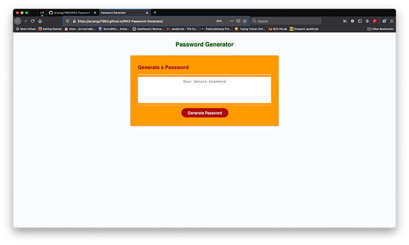

# WK3-Password-Generator

## Description

The assignment here was to modify existing script code to for the app so that a secure password based on criteria from user input would be generated when a button was pushed. Prompts were to display requesting the user's input. Only the HTML, CSS structures plus a small portion of the script functions controlling the button event and text submission to application text area were supplied.
The challenge here was knowing where to start coding first. That required applying some knowlege already acquired in addition to a good amount of research. Ultimately, I was able to find what I needed and began outlining the application functionality to include the criteria given before I began writing any code. Once I had a working outline the code writing proceeded quickly. After a little testing and QA the application functions as required. I made a few changes to the CSS styling also to improve the applications accessibility.

## Installation

My files can be accessed in the repository [HERE](https://github.com/arcangyl1963/WK3-Password-Generator)
The image below shows the repository where my project files are located:

The web application can be viewed [HERE](https://arcangyl1963.github.io/WK3-Password-Generator/).

The image below shows the Password Generator Application: 

© 2021 arcangyl studios